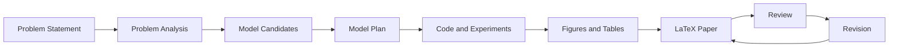

# Architecture

本项目采用“文档驱动 + 代码可复现 + LaTeX 输出”的结构。

## 核心对象

- `problems/problem.md`：题面和输入材料。
- `runs/current/`：当前生成过程的阶段性产物。
- `src/`：数据处理、模型求解、仿真和绘图代码。
- `paper/`：LaTeX 论文工程。
- `reviews/`：自查报告和人工复核记录。
- `prompts/`：可迭代的阶段提示词。

## 数据流

## 设计原则

- 论文结论依赖模型和实验，不依赖泛泛写作。
- 图表由代码生成，便于复现和审查。
- 审查结果保留在仓库中，便于长期改进。
- Claude Code 负责执行流程，但每一步都留下人类可检查的中间文件。

